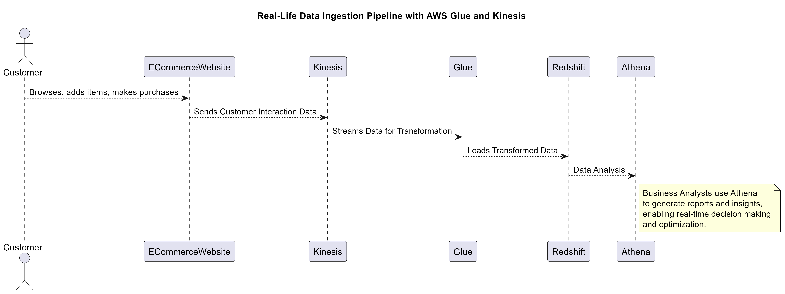

# Exploring AWS Glue and Kinesis: Building Data Pipelines for Real-Time Insights

In my recent deep dive into cloud-based data engineering, I've been focusing on how AWS Glue and Amazon Kinesis can be combined to create effective data ingestion pipelines. These tools work together to handle both batch processing and real-time data streams, transforming raw data into something that businesses can actually use for analytics and smarter decision-making.

**AWS Glue** makes it easy to extract, transform, and load (ETL) data from various sources. It’s serverless, so you don’t have to worry about managing infrastructure, and it really simplifies the process of getting your data into a usable state for things like reports and analysis. I’ve been working with it to understand how to automate data workflows and keep everything running smoothly between different systems.

**Amazon Kinesis** adds another layer of power by handling real-time data streams. This is crucial for companies that need up-to-the-minute information to respond quickly—whether it's tracking website activity, processing payments, or analyzing customer behavior. By experimenting with Kinesis, I’ve seen how you can set up scalable pipelines that give you real-time insights into your business.

**Amazon Redshift** and **Amazon Athena** further enhance this setup:

- **Amazon Redshift** is a fully managed data warehouse that enables fast querying and analysis of large datasets. After AWS Glue transforms and loads data into Redshift, it allows for complex queries and aggregations to generate insightful reports. It’s ideal for analyzing structured data and supporting data warehousing needs with high performance.

- **Amazon Athena** provides interactive query capabilities directly on data stored in Amazon S3. It’s a serverless service that lets you run SQL queries on data without needing to set up or manage infrastructure. After data is loaded into S3 by AWS Glue, Athena allows you to quickly query and analyze it to gain insights without the need for a traditional data warehouse.

**Real-Life Example:**

Take a big retail company as an example. Every time a customer interacts with their online store—browsing products, adding items to their cart, or making a purchase—Kinesis can capture that data in real-time. AWS Glue then steps in to clean and organize the data. This transformed data is loaded into **Amazon Redshift** for detailed analysis and into **Amazon S3**, where **Amazon Athena** can be used for quick ad-hoc queries. This setup allows the company to quickly analyze customer behavior, adjust marketing strategies, and even optimize inventory based on what’s happening right now.

Studying AWS Glue and Kinesis has given me a solid understanding of how these tools can work together to build data pipelines that process both batch and real-time data. It’s exciting to see how cloud services like these can make complex data workflows much simpler and more scalable for any business.

