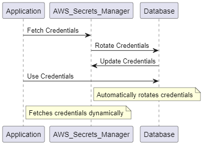

## 🔑 Enhancing Application Security with AWS Secrets Manager

Elevate your application's security by integrating AWS Secrets Manager into your infrastructure. This robust tool is designed to **securely store, manage, and rotate sensitive information** such as API keys, database credentials, and other critical access details.

### Key Benefits:
- **Automated Secret Management:** Reduce the risk of accidental exposure and unauthorized access by automating the lifecycle of your secrets.
- **Seamless Integration:** AWS Secrets Manager integrates effortlessly with your existing AWS services, ensuring your sensitive data remains encrypted and accessible only to authorized entities.
- **Improved Security Posture:** By retrieving credentials dynamically instead of hardcoding them, you minimize the risk of exposing sensitive information in code repositories or logs.

### Real-World Application:
Consider a scenario where AWS Secrets Manager automatically rotates your database credentials without any downtime. Rather than embedding credentials directly into your application code, you can securely fetch them from AWS Secrets Manager. This practice not only protects your data but also enhances your application's overall security.

**Leverage AWS Secrets Manager** to fortify your application's security and streamline the management of your sensitive information.

  

### Question:

You are designing an application that requires secure storage and retrieval of database credentials. The application runs on Amazon EC2 instances within an Auto Scaling group behind an Elastic Load Balancer. The credentials need to be rotated periodically to meet security compliance requirements. Which solution will meet these requirements with the least operational overhead?

- A) Store the credentials in the EC2 instance metadata and update them manually during instance launches.
- B) Use AWS Secrets Manager to store the credentials, configure automatic rotation, and update the application to retrieve the credentials programmatically.
- C) Store the credentials in an S3 bucket with server-side encryption and configure lifecycle policies to rotate the credentials.
- D) Use AWS Key Management Service (KMS) to encrypt the credentials and store them in an environment variable in the EC2 instance.

**Correct Answer:**  
**B)** Use AWS Secrets Manager to store the credentials, configure automatic rotation, and update the application to retrieve the credentials programmatically.

**Explanation:**  
AWS Secrets Manager is designed to store, retrieve, and automatically rotate secrets, such as database credentials. It reduces operational overhead by handling credential rotation automatically and allows your application to retrieve updated credentials programmatically. This makes it the most suitable option for securely managing secrets in an environment like Auto Scaling, where instances are dynamically created and terminated.
